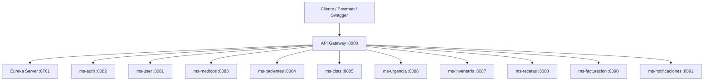

# Sistema Hospitalario - Microservicios

## Datos Del Proyecto

| Campo | Detalle |
|---|---|
| Proyecto | Sistema Hospitalario distribuido |
| Arquitectura | Microservicios con Spring Boot |
| Lenguaje | Java 17 |
| Base de datos | MySQL |
| Descubrimiento | Eureka Server |
| Entrada centralizada | API Gateway |
| Seguridad | JWT |
| Documentacion | Swagger / OpenAPI |
| Pruebas | JUnit 5 + Mockito |
| Contenedores | Docker + Docker Compose |

## Integrantes

| Integrante | Responsabilidad principal |
|---|---|
| Jordy Solis | `ms-medicos-main`, `ms-pacientes-main`, `ms-citas`, `ms-urgencia` |
| Anderson Ovando | `eureka-hospital`, `api-gateway`, `ms-user`, `ms-auth` |
| Matias Javier | `ms-inventario`, `ms-recetas`, `ms-facturacion`, `ms-notificaciones` |

## Descripcion General

Este proyecto implementa un sistema hospitalario basado en arquitectura de microservicios. Cada servicio mantiene su propia responsabilidad, expone endpoints REST, se registra en Eureka y puede ser consumido directamente por Swagger o mediante API Gateway.

El sistema permite gestionar usuarios, autenticacion, medicos, pacientes, citas, urgencias, inventario, recetas, facturacion y notificaciones.

## Estructura Del Repositorio

```text
MS_Hospital/
├── Dockerfile
├── docker-compose.yml
├── .dockerignore
├── DOCKER-GUIA.md
├── README.md
├── eureka-hospital/
├── api-gateway/
├── ms-auth/
├── ms-user/
├── ms-medicos-main/
├── ms-pacientes-main/
├── ms-citas/
├── ms-urgencia/
├── ms-inventario/
├── ms-recetas/
├── ms-facturacion/
└── ms-notificaciones/
```

## Microservicios

| Carpeta | Nombre en Eureka | Puerto Docker | Base de datos | Funcion principal |
|---|---|---:|---|---|
| `eureka-hospital` | `eureka-hospital` | `8761` | No aplica | Registro y descubrimiento de servicios. |
| `api-gateway` | `api-gateway` | `8080` | No aplica | Entrada centralizada para consumir los microservicios. |
| `ms-user` | `ms-user` | `8081` | `db_user` | Usuarios, roles y datos de acceso. |
| `ms-auth` | `ms-auth` | `8082` | No aplica | Login y generacion de token JWT. |
| `ms-medicos-main` | `ms-medicos` | `8083` | `db_medicos` | CRUD de medicos. |
| `ms-pacientes-main` | `ms-pacientes` | `8084` | `db_pacientes` | CRUD de pacientes. |
| `ms-citas` | `ms-citas` | `8085` | `db_citas` | Gestion de citas medicas. |
| `ms-urgencia` | `ms-urgencias` | `8086` | `db_urgencias` | Registro de urgencias y triage. |
| `ms-inventario` | `ms-inventario` | `8087` | `db_inventario` | Productos, lotes, precios y stock. |
| `ms-recetas` | `ms-recetas` | `8088` | `db_recetas` | Emision de recetas y descuento de stock. |
| `ms-facturacion` | `ms-facturacion` | `8090` | `db_facturacion` | Facturas asociadas a recetas. |
| `ms-notificaciones` | `ms-notificaciones` | `8091` | `db_notificaciones` | Notificaciones para usuarios del sistema. |

## Arquitectura General



## Ejecutar Con Docker

### Requisitos

- Docker Desktop instalado.
- Docker Desktop abierto.
- Ejecutar comandos desde la raiz del proyecto, donde esta `docker-compose.yml`.

### Levantar Todo El Proyecto

```bash
docker compose up --build
```

La primera ejecucion puede demorar porque descarga imagenes de Java, Maven, MySQL y dependencias del proyecto.

### Levantar En Segundo Plano

```bash
docker compose up --build -d
```

### Ver Contenedores

```bash
docker compose ps
```

### Ver Logs

Todos los servicios:

```bash
docker compose logs -f
```

Un servicio especifico:

```bash
docker compose logs -f ms-medicos
```

### Reconstruir Un Solo Microservicio

```bash
docker compose up --build ms-medicos
```

```bash
docker compose up --build ms-pacientes
```

### Apagar El Proyecto

```bash
docker compose down
```

### Apagar Y Borrar La Base De Datos Docker

```bash
docker compose down -v
```

## MySQL En Docker

Docker levanta un MySQL propio. No depende de XAMPP.

| Dato | Valor |
|---|---|
| Host desde tu PC | `localhost` |
| Puerto desde tu PC | `3307` |
| Host dentro de Docker | `mysql` |
| Puerto dentro de Docker | `3306` |
| Usuario | `root` |
| Password | `root` |

Si el puerto `3307` esta ocupado, cambiar en `docker-compose.yml`:

```yaml
ports:
  - "3307:3306"
```

Por ejemplo:

```yaml
ports:
  - "3308:3306"
```

## URLs Principales

| Servicio | URL |
|---|---|
| Eureka | `http://localhost:8761` |
| API Gateway | `http://localhost:8080` |
| ms-user Swagger | `http://localhost:8081/swagger-ui.html` |
| ms-auth Swagger | `http://localhost:8082/swagger-ui.html` |
| ms-medicos Swagger | `http://localhost:8083/swagger-ui.html` |
| ms-pacientes Swagger | `http://localhost:8084/swagger-ui.html` |
| ms-citas Swagger | `http://localhost:8085/swagger-ui.html` |
| ms-urgencia Swagger | `http://localhost:8086/swagger-ui.html` |
| ms-inventario Swagger | `http://localhost:8087/swagger-ui.html` |
| ms-recetas Swagger | `http://localhost:8088/swagger-ui.html` |
| ms-facturacion Swagger | `http://localhost:8090/swagger-ui.html` |
| ms-notificaciones Swagger | `http://localhost:8091/swagger-ui.html` |

## Rutas Por API Gateway

| Ruta Gateway | Microservicio |
|---|---|
| `http://localhost:8080/api/users` | `ms-user` |
| `http://localhost:8080/api/auth` | `ms-auth` |
| `http://localhost:8080/api/medicos` | `ms-medicos` |
| `http://localhost:8080/api/pacientes` | `ms-pacientes` |
| `http://localhost:8080/api/citas` | `ms-citas` |
| `http://localhost:8080/api/urgencias` | `ms-urgencia` |
| `http://localhost:8080/api/productos` | `ms-inventario` |
| `http://localhost:8080/api/recetas` | `ms-recetas` |
| `http://localhost:8080/api/facturas` | `ms-facturacion` |
| `http://localhost:8080/api/notificaciones` | `ms-notificaciones` |

## Ejecutar Sin Docker

### Requisitos

- Java 17.
- Maven.
- MySQL activo en XAMPP.
- Puertos libres.

### Orden Recomendado

```bash
cd eureka-hospital
mvn spring-boot:run
```

```bash
cd ms-user
mvn spring-boot:run
```

```bash
cd ms-auth
mvn spring-boot:run
```

Luego iniciar los servicios de negocio:

```bash
cd ms-medicos-main
mvn spring-boot:run
```

```bash
cd ms-pacientes-main
mvn spring-boot:run
```

```bash
cd ms-citas
mvn spring-boot:run
```

```bash
cd ms-urgencia
mvn spring-boot:run
```

```bash
cd ms-inventario
mvn spring-boot:run
```

```bash
cd ms-recetas
mvn spring-boot:run
```

```bash
cd ms-facturacion
mvn spring-boot:run
```

```bash
cd ms-notificaciones
mvn spring-boot:run
```

Finalmente:

```bash
cd api-gateway
mvn spring-boot:run
```

## Seguridad JWT

Flujo recomendado:

1. Levantar `ms-user` y `ms-auth`.
2. Hacer login en `ms-auth`.
3. Copiar el token generado.
4. En Swagger presionar `Authorize`.
5. Pegar el token segun la configuracion del microservicio.

Para Postman:

```text
Authorization: Bearer <token>
```

Roles usados:

```text
ADMIN
MEDICO
OPERADOR
PACIENTE
```

## Pruebas Unitarias

Los 10 microservicios de negocio/autenticacion tienen pruebas de service y controller.

| Microservicio | Service test | Controller test |
|---|---|---|
| `ms-auth` | Si | Si |
| `ms-user` | Si | Si |
| `ms-medicos-main` | Si | Si |
| `ms-pacientes-main` | Si | Si |
| `ms-citas` | Si | Si |
| `ms-urgencia` | Si | Si |
| `ms-inventario` | Si | Si |
| `ms-recetas` | Si | Si |
| `ms-facturacion` | Si | Si |
| `ms-notificaciones` | Si | Si |

Ejecutar pruebas:

```bash
cd ms-citas
mvn clean test
```

Ejecutar build completo de un microservicio:

```bash
mvn clean install
```

## Comunicacion Entre Microservicios

| Origen | Destino | Motivo |
|---|---|---|
| `ms-auth` | `ms-user` | Buscar usuario y roles para login. |
| `ms-citas` | `ms-medicos` | Validar medico antes de agendar cita. |
| `ms-citas` | `ms-pacientes` | Validar paciente antes de agendar cita. |
| `ms-urgencia` | `ms-pacientes` | Asociar urgencia a paciente registrado. |
| `ms-recetas` | `ms-inventario` | Descontar o reponer stock. |
| `ms-facturacion` | `ms-recetas` | Obtener datos de receta. |
| `ms-facturacion` | `ms-inventario` | Obtener precio de producto. |

## Flujo Recomendado Para Probar

1. Verificar Eureka en `http://localhost:8761`.
2. Confirmar servicios registrados como `UP`.
3. Obtener token desde `ms-auth`.
4. Crear o listar medicos.
5. Crear o listar pacientes.
6. Crear una cita con medico y paciente.
7. Crear producto en inventario.
8. Emitir receta y validar descuento de stock.
9. Generar factura desde receta.
10. Crear notificacion.
11. Marcar notificacion como enviada o leida.

## Archivos Importantes Para Docker

| Archivo | Funcion |
|---|---|
| `Dockerfile` | Compila cualquier microservicio usando el argumento `SERVICE_DIR`. |
| `docker-compose.yml` | Levanta MySQL, Eureka, Gateway y todos los microservicios. |
| `.dockerignore` | Evita subir `target`, IDE metadata y archivos innecesarios al build. |
| `DOCKER-GUIA.md` | Guia rapida enfocada solo en comandos Docker. |

## Consideraciones De Entrega

No subir archivos generados:

```text
target/
*.class
*.jar
*.log
```

El repositorio debe incluir:

- Codigo fuente en `src/main/java`.
- Pruebas en `src/test/java`.
- `pom.xml` de cada microservicio.
- Configuracion `application.yml` o `application.properties`.
- `Dockerfile`.
- `docker-compose.yml`.
- `.dockerignore`.
- `README.md`.
- `DOCKER-GUIA.md`.

## Problemas Comunes

### Docker No Inicia

Verificar que Docker Desktop este abierto.

```bash
docker --version
docker compose version
```

### Puerto Ocupado

Si un puerto esta ocupado, cerrar el programa que lo usa o cambiar el puerto externo en `docker-compose.yml`.

### MySQL De XAMPP Interfiere

Docker usa su propio MySQL. Si el puerto `3307` esta ocupado por XAMPP, cambiar el puerto externo del servicio `mysql` en `docker-compose.yml`.

### Swagger Responde 403

Obtener token desde `ms-auth` y usar `Authorize` en Swagger o header `Authorization` en Postman.

### Un Servicio No Aparece En Eureka

Revisar logs:

```bash
docker compose logs -f nombre-servicio
```

Ejemplo:

```bash
docker compose logs -f ms-citas
```

## Estado Final

El proyecto queda preparado con microservicios Spring Boot, Eureka, API Gateway, JWT, Swagger, pruebas unitarias de service y controller, MySQL y ejecucion completa mediante Docker Compose.
