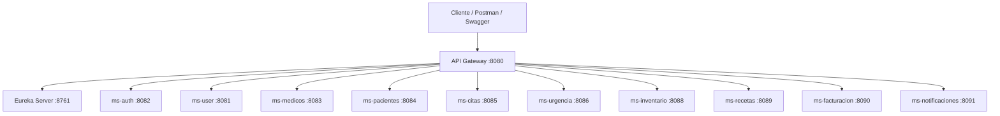

# Sistema Hospitalario - Arquitectura de Microservicios

## Datos del Proyecto

| Campo | Detalle |
|---|---|
| Proyecto | Sistema Hospitalario distribuido |
| Asignatura | Desarrollo FullStack 1 |
| Arquitectura | Microservicios con Spring Boot |
| Base de datos | MySQL |
| Descubrimiento de servicios | Eureka Server |
| Entrada centralizada | API Gateway |
| Seguridad | JWT |
| Documentacion | Swagger / OpenAPI |
| Pruebas | JUnit 5 + Mockito |

## Integrantes

| Integrante | Responsabilidad principal |
|---|---|
| Jordy Solis | `ms-medicos`, `ms-pacientes`, `ms-citas`, `ms-urgencia`, `ms-notificaciones` |
| Anderson Ovando | `eureka-hospital`, `api-gateway`, `ms-user`, `ms-auth` |
| Matias Javier | `ms-inventario`, `ms-recetas`, `ms-facturacion` |

## Video de Funcionamiento

[Pruebas de funcionamiento de Microservicios](https://youtu.be/3vS0kl0Pq2E?si=9QnQGhsAi4bDYB4D)

## Descripcion General

Este proyecto implementa un sistema hospitalario basado en microservicios independientes. Cada microservicio representa una parte del dominio hospitalario y se comunica con otros servicios cuando necesita validar informacion o completar un flujo de negocio.

La arquitectura permite separar responsabilidades, mantener servicios independientes, documentar endpoints mediante Swagger, centralizar rutas mediante API Gateway y registrar servicios activos en Eureka.

El sistema cubre los siguientes procesos:

- Gestion de usuarios y autenticacion.
- Gestion de medicos.
- Gestion de pacientes.
- Agendamiento de citas medicas.
- Registro de urgencias.
- Control de inventario hospitalario.
- Emision de recetas medicas.
- Facturacion asociada a recetas.
- Envio y lectura de notificaciones.

## Arquitectura del Sistema



## Microservicios Implementados

| Carpeta | Nombre en Eureka | Puerto | Base de datos | Responsable | Funcion principal |
|---|---|---:|---|---|---|
| `eureka-hospital` | `eureka-hospital` | `8761` | No aplica | Anderson | Servidor de descubrimiento. Permite registrar y visualizar microservicios activos. |
| `api-gateway` | `api-gateway` | `8080` | No aplica | Anderson | Punto de entrada centralizado. Redirige peticiones hacia los microservicios. |
| `ms-user` | `ms-user` | `8081` | `db_user` | Anderson | Gestiona usuarios, roles y datos asociados al acceso al sistema. |
| `ms-auth` | `ms-auth` | `8082` | Segun configuracion | Anderson | Realiza login y genera tokens JWT para consumir endpoints protegidos. |
| `ms-medicos-main` | `ms-medicos` | `8083` | `db_medicos` | Jordy | CRUD de medicos, especialidades, sectores y datos profesionales. |
| `ms-pacientes-main` | `ms-pacientes` | `8084` | `db_pacientes` | Jordy | CRUD de pacientes y registro de datos personales/prevision. |
| `ms-citas` | `ms-citas` | `8085` | `db_citas` | Jordy | Gestiona citas medicas entre pacientes y medicos. |
| `ms-urgencia` | `ms-urgencias` | `8086` | `db_urgencias` | Jordy | Registra atenciones de urgencia, triage, motivo y cierre de atencion. |
| `ms-inventario` | `ms-inventario` | `8088` | `db_inventario` | Matias | Controla insumos, medicamentos, stock, precio, lote y vencimiento. |
| `ms-recetas` | `ms-recetas` | `8089` | `db_recetas` | Matias | Emite recetas medicas y descuenta stock desde inventario. |
| `ms-facturacion` | `ms-facturacion` | `8090` | `db_facturacion` | Matias | Genera facturas desde recetas y calcula montos usando inventario. |
| `ms-notificaciones` | `ms-notificaciones` | `8091` | `db_notificaciones` | Jordy | Registra notificaciones para pacientes, medicos o administradores. |

## Patron de Arquitectura Interna

Cada microservicio mantiene una estructura basada en el patron CSR:

```text
microservicio/
├── pom.xml
├── src/
│   ├── main/
│   │   ├── java/
│   │   │   └── com/hospital/nombre_servicio/
│   │   │       ├── config/
│   │   │       ├── controller/
│   │   │       ├── dto/
│   │   │       ├── exception/
│   │   │       ├── mapper/
│   │   │       ├── model/
│   │   │       ├── repository/
│   │   │       └── service/
│   │   └── resources/
│   │       └── application.yml
│   └── test/
│       └── java/
```

| Capa | Responsabilidad |
|---|---|
| `controller` | Expone endpoints REST, recibe DTOs y retorna respuestas HTTP. |
| `service` | Contiene reglas de negocio y coordina validaciones. |
| `repository` | Acceso a datos mediante Spring Data JPA. |
| `model` | Entidades persistentes del dominio. |
| `dto` | Objetos de transferencia para requests y responses. |
| `mapper` | Convierte entidades a DTOs y DTOs a entidades. |
| `exception` | Manejo centralizado de errores. |
| `config` | Swagger, seguridad JWT, Feign y configuraciones auxiliares. |

## Tecnologias Utilizadas

| Tecnologia | Uso |
|---|---|
| Java 17 | Lenguaje de programacion principal. |
| Spring Boot | Desarrollo de microservicios REST. |
| Spring Web | Creacion de controladores y endpoints HTTP. |
| Spring Data JPA | Persistencia con repositorios. |
| MySQL | Base de datos relacional. |
| Spring Cloud Eureka | Registro y descubrimiento de servicios. |
| Spring Cloud Gateway | Enrutamiento centralizado. |
| OpenFeign | Comunicacion REST entre microservicios. |
| Spring Security | Proteccion de endpoints. |
| JWT | Autenticacion basada en token. |
| Swagger/OpenAPI | Documentacion interactiva. |
| JUnit 5 | Pruebas unitarias. |
| Mockito | Simulacion de dependencias en pruebas. |
| Maven | Gestion de dependencias y ejecucion. |

## Comunicacion entre Microservicios

| Microservicio origen | Microservicio destino | Motivo |
|---|---|---|
| `ms-citas` | `ms-medicos` | Validar que el medico exista antes de crear una cita. |
| `ms-citas` | `ms-pacientes` | Validar que el paciente exista antes de crear una cita. |
| `ms-urgencia` | `ms-pacientes` | Asociar una urgencia a un paciente registrado. |
| `ms-recetas` | `ms-inventario` | Descontar stock cuando se emite una receta. |
| `ms-recetas` | `ms-inventario` | Reponer stock si una receta se anula o elimina. |
| `ms-facturacion` | `ms-recetas` | Obtener datos de la receta facturada. |
| `ms-facturacion` | `ms-inventario` | Obtener precio del producto para calcular el total. |

## API Gateway

El API Gateway corre en:

```text
http://localhost:8080
```

Rutas principales:

| Ruta | Microservicio |
|---|---|
| `/api/users/**` | `ms-user` |
| `/api/auth/**` | `ms-auth` |
| `/api/medicos/**` | `ms-medicos` |
| `/api/pacientes/**` | `ms-pacientes` |
| `/api/citas/**` | `ms-citas` |
| `/api/urgencias/**` | `ms-urgencia` |
| `/api/productos/**` | `ms-inventario` |
| `/api/recetas/**` | `ms-recetas` |
| `/api/facturas/**` | `ms-facturacion` |
| `/api/notificaciones/**` | `ms-notificaciones` |

Ejemplo de configuracion en `api-gateway/src/main/resources/application.properties`:

```properties
spring.cloud.gateway.routes[0].id=ms-user-route
spring.cloud.gateway.routes[0].uri=lb://ms-user
spring.cloud.gateway.routes[0].predicates[0]=Path=/api/users/**
```

## Swagger / OpenAPI

| Servicio | URL Swagger |
|---|---|
| `ms-user` | `http://localhost:8081/swagger-ui.html` |
| `ms-auth` | `http://localhost:8082/swagger-ui.html` |
| `ms-medicos` | `http://localhost:8083/swagger-ui.html` |
| `ms-pacientes` | `http://localhost:8084/swagger-ui.html` |
| `ms-citas` | `http://localhost:8085/swagger-ui.html` |
| `ms-urgencia` | `http://localhost:8086/swagger-ui.html` |
| `ms-inventario` | `http://localhost:8088/swagger-ui.html` |
| `ms-recetas` | `http://localhost:8089/swagger-ui.html` |
| `ms-facturacion` | `http://localhost:8090/swagger-ui.html` |
| `ms-notificaciones` | `http://localhost:8091/swagger-ui.html` |

Para endpoints protegidos:

1. Iniciar `ms-user` y `ms-auth`.
2. Realizar login desde `ms-auth`.
3. Copiar el token JWT.
4. En Swagger presionar `Authorize`.
5. Pegar solo el token, sin escribir `Bearer`.

## Requisitos Previos

Antes de ejecutar el sistema:

- Tener MySQL activo desde XAMPP.
- Tener JDK 17 instalado.
- Tener Maven instalado y configurado.
- Tener los puertos libres.
- Tener conexion a internet si Maven necesita descargar dependencias.

Verificar Java:

```bat
java -version
```

Verificar Maven:

```bat
mvn -v
```

Maven debe usar Java 17. Si aparece Java 8, se debe corregir `JAVA_HOME`.

## Bases de Datos

Las bases se crean automaticamente por la propiedad `createDatabaseIfNotExist=true` al iniciar cada servicio.

| Base de datos | Microservicio |
|---|---|
| `db_user` | `ms-user` |
| `db_medicos` | `ms-medicos` |
| `db_pacientes` | `ms-pacientes` |
| `db_citas` | `ms-citas` |
| `db_urgencias` | `ms-urgencia` |
| `db_inventario` | `ms-inventario` |
| `db_recetas` | `ms-recetas` |
| `db_facturacion` | `ms-facturacion` |
| `db_notificaciones` | `ms-notificaciones` |

Usuario local esperado:

```text
username: root
password:
```

## Orden de Ejecucion Local

Se recomienda ejecutar los servicios manualmente desde VS Code, IntelliJ IDEA o terminal, en este orden:

### 1. Eureka

```bat
cd eureka-hospital
mvn spring-boot:run
```

Verificar:

```text
http://localhost:8761
```

### 2. Usuarios y autenticacion

```bat
cd ms-user
mvn spring-boot:run
```

```bat
cd ms-auth
mvn spring-boot:run
```

### 3. Servicios clinicos base

```bat
cd ms-medicos-main
mvn spring-boot:run
```

```bat
cd ms-pacientes-main
mvn spring-boot:run
```

### 4. Servicios clinicos dependientes

```bat
cd ms-citas
mvn spring-boot:run
```

```bat
cd ms-urgencia
mvn spring-boot:run
```

### 5. Servicios administrativos

```bat
cd ms-inventario
mvn spring-boot:run
```

```bat
cd ms-recetas
mvn spring-boot:run
```

```bat
cd ms-facturacion
mvn spring-boot:run
```

```bat
cd ms-notificaciones
mvn spring-boot:run
```

### 6. API Gateway

```bat
cd api-gateway
mvn spring-boot:run
```

## Pruebas Unitarias

Cada microservicio contiene pruebas en:

```text
src/test/java
```

Para ejecutar pruebas:

```bat
cd nombre-del-microservicio
mvn clean test
```

Ejemplo:

```bat
cd ms-citas
mvn clean test
```

Las pruebas validan:

- Reglas de negocio.
- Servicios con repositorios mockeados.
- Clientes Feign simulados cuando corresponde.
- Excepciones esperadas.
- Estados y calculos relevantes.

## Reglas de Negocio por Microservicio

| Microservicio | Reglas principales |
|---|---|
| `ms-user` | Gestion de usuarios y roles. |
| `ms-auth` | Valida credenciales y genera JWT. |
| `ms-medicos` | Administra medicos y evita datos invalidos o duplicados. |
| `ms-pacientes` | Administra pacientes y valida informacion personal. |
| `ms-citas` | Agenda citas con paciente y medico validos. |
| `ms-urgencia` | Registra urgencias con triage y permite cerrar atenciones. |
| `ms-inventario` | Controla stock, lote unico, precio y vencimiento. |
| `ms-recetas` | Emite recetas y descuenta stock desde inventario. |
| `ms-facturacion` | Calcula facturas usando receta e inventario. |
| `ms-notificaciones` | Controla estados de notificaciones: `PENDIENTE`, `ENVIADA`, `LEIDA`, `FALLIDA`. |

## Flujo Recomendado para Probar en Defensa

1. Iniciar Eureka y verificar servicios `UP`.
2. Iniciar `ms-user` y `ms-auth`.
3. Obtener token JWT.
4. Crear o listar un medico.
5. Crear o listar un paciente.
6. Crear una cita asociando medico y paciente.
7. Crear producto en inventario.
8. Emitir receta y verificar descuento de stock.
9. Generar factura desde la receta.
10. Marcar factura como pagada.
11. Crear notificacion para paciente.
12. Marcar notificacion como enviada y luego como leida.

Este flujo demuestra:

- CRUD.
- Validaciones.
- Comunicacion entre microservicios.
- Seguridad JWT.
- Swagger.
- Persistencia en MySQL.
- Uso de Gateway y Eureka.

## Seguridad JWT

Los endpoints principales se protegen con JWT. El flujo es:

1. El usuario se autentica en `ms-auth`.
2. `ms-auth` devuelve un token.
3. El token se envia en:

```text
Authorization: Bearer <token>
```

En Swagger se debe pegar solo el token dentro de `Authorize`.

Roles usados:

```text
ADMIN
MEDICO
OPERADOR
```

## Configuracion YAML

Cada servicio contiene configuracion de:

- Puerto.
- Nombre del servicio.
- Conexion a MySQL.
- JPA/Hibernate.
- Eureka.
- Swagger.
- JWT cuando aplica.

Ejemplo:

```yaml
server:
  port: 8085

spring:
  application:
    name: ms-citas

eureka:
  client:
    service-url:
      defaultZone: http://localhost:8761/eureka/
```

## Consideraciones para Entrega

No subir archivos generados:

```text
target/
*.class
*.jar
*.log
```

El repositorio debe incluir:

- Carpetas de microservicios.
- `README.md`.
- `pom.xml` por microservicio.
- Codigo fuente en `src/main/java`.
- Configuracion en `src/main/resources`.
- Pruebas en `src/test/java`.
- Documentacion Swagger.
- Configuracion Gateway.

## Problemas Comunes

### Maven no se reconoce

```bat
mvn -v
```

Si falla, Maven no esta agregado al `PATH`.

### Maven usa Java 8

```bat
mvn -v
```

Debe decir Java 17. Si dice Java 8, corregir `JAVA_HOME`.

### Swagger responde 403

Ingresar a `Authorize` y pegar el token JWT sin escribir `Bearer`.

### Eureka no muestra servicios

Verificar que Eureka este iniciado:

```text
http://localhost:8761
```

Y que cada microservicio tenga configurado:

```yaml
eureka:
  client:
    service-url:
      defaultZone: http://localhost:8761/eureka/
```

### Puerto 3306 ocupado

Verificar que MySQL de XAMPP este iniciado y que no exista otro MySQL usando el mismo puerto.

## Estado Final

El sistema cuenta con mas de 10 microservicios, estructura por capas, documentacion Swagger, seguridad JWT, pruebas unitarias, configuracion YAML, Eureka, API Gateway y comunicacion REST entre servicios mediante Feign Client.

La ejecucion local puede realizarse desde el IDE o por terminal usando Maven.
